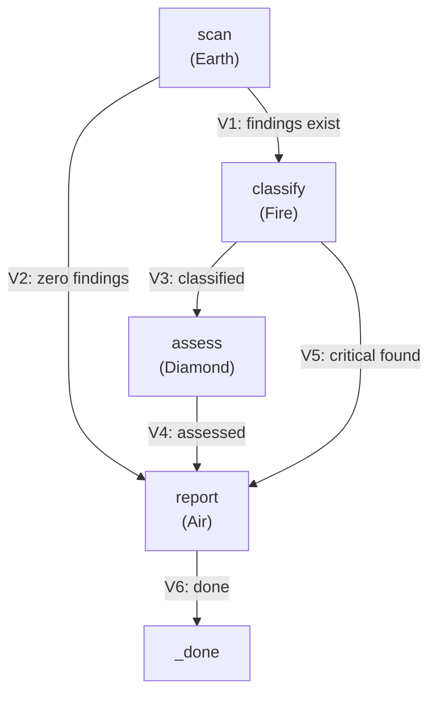
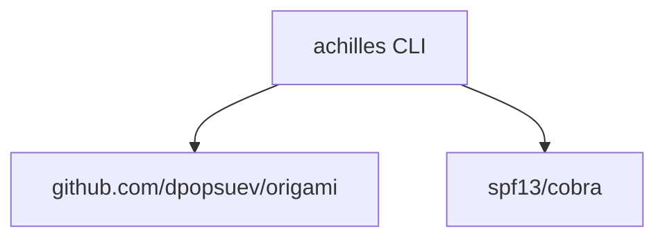

# Achilles Architecture

## Overview

Achilles (`github.com/dpopsuev/achilles`) is an AI-driven vulnerability discovery tool built entirely on the Origami agentic pipeline framework. It goes beyond detecting known CVEs: it uses meta-pattern recognition across codebases, dependencies, and historical vulnerability data to surface *novel* vulnerabilities that conventional scanners cannot find. Known-vulnerability detection (via pluggable backends like `govulncheck`) is the baseline; pattern-based discovery of unknowns is the mission. Initial dataset, calibration, and wet-run targets: Red Hat's core products (RHEL, OCP).

## Pipeline

4-node graph with shortcut edges for clean repos:

### Nodes

| Node | Element | Purpose |
|------|---------|---------|
| **scan** | Earth | Executes `govulncheck -json` on the target repo |
| **classify** | Fire | Deduplicates findings, assigns severity (Critical/High/Medium/Low) |
| **assess** | Diamond | Calculates risk score from severity distribution |
| **report** | Air | Formats human-readable colored output |

### Key edges

- **V2 (shortcut):** When `govulncheck` finds zero vulnerabilities, skip directly to report.
- **V5 (shortcut):** When a critical vulnerability is found during classification, skip assessment and report immediately.

## Dependency

Achilles imports **only** Origami and Cobra. Zero imports from Asterisk or any other consumer tool.

## Shared Origami primitives used

| Primitive | Achilles usage |
|-----------|---------------|
| `PipelineDef` / `LoadPipeline` | `pipelines/achilles.yaml` |
| `NodeRegistry` | scan, classify, assess, report factories |
| `EdgeFactory` | V1-V6 edge evaluation |
| `Graph` / `Walk` | Pipeline execution |
| `Walker` / `WalkerState` | Herald persona |
| `Artifact` / `Confidence` | Typed scan/classify/assess/report artifacts |
| `Element` affinity | Earth, Fire, Diamond, Air per node |
| `Extractor` | GovulncheckExtractor, ClassifyExtractor |
| `Render` (Mermaid) | Pipeline visualization via `achilles render` |
| `WalkObserver` | Live event trace during scan |

## What Achilles does NOT use (yet)

Adversarial Dialectic, Masks, Team Walk, Cycles, Ouroboros (metacalibration) — available via Origami but not needed for the current pipeline.

## For deeper framework concepts

See `github.com/dpopsuev/origami` and its `docs/framework-guide.md`.
